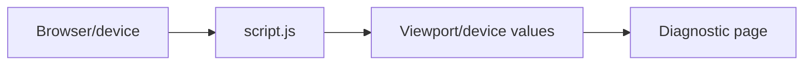

# RPUK Phone Test Site

<p align="center">
  <a href="https://github.com/KeyErrorFinn/rpuk-phone-test-site/commits/main"></a>
  <a href="https://github.com/KeyErrorFinn/rpuk-phone-test-site/issues"></a>
</p>

<p align="center">
  
  
  
  
</p>

A small static page for testing browser/device information and responsive behaviour in an RPUK phone-style environment.

## How it works

- `index.html` provides the device-information layout.
- `script.js` reads browser viewport/device values and displays them on the page.
- `style.css` controls the presentation.
- `ethan-face.png` is a page asset.

There is no build step or backend.

## Running locally

Open `index.html` directly, or serve the directory so it behaves like a normal website:

```bash
python -m http.server 8000
```

Visit `http://localhost:8000` and resize the window or open the page on different devices to compare the reported values.

## Deployment

The repository can be hosted by any static host, including GitHub Pages. Only publish it if the included image and any displayed diagnostic information are appropriate for the intended audience.

## Project flow


