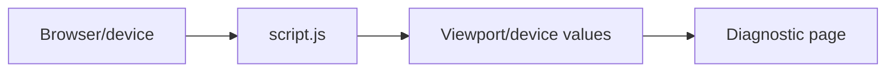

# RPUK Phone Test Site

[](https://github.com/KeyErrorFinn/rpuk-phone-test-site/commits/main) [](https://github.com/KeyErrorFinn/rpuk-phone-test-site/issues)

A small static page for testing browser/device information and responsive behaviour in an RPUK phone-style environment.

## How it works

- `index.html` provides the device-information layout.
- `script.js` reads browser viewport/device values and displays them on the page.
- `style.css` controls the presentation.
- `ethan-face.png` is a page asset.

There is no build step or backend.

## Running locally

Open `index.html` directly, or serve the directory so it behaves like a normal website:

```bash
python -m http.server 8000
```

Visit `http://localhost:8000` and resize the window or open the page on different devices to compare the reported values.

## Deployment

The repository can be hosted by any static host, including GitHub Pages. Only publish it if the included image and any displayed diagnostic information are appropriate for the intended audience.

<!-- documentation-extras -->

## Project flow



<details>
<summary>Documentation and maintenance notes</summary>

- Commands and behaviour in this README are derived from the files currently committed to the repository.
- External services, games, websites, browser APIs, and file formats can change independently of this project.
- When reporting a problem, include the operating system, runtime version, exact command, and complete error text with secrets removed.

</details>

## Contributing

Focused fixes are welcome. Before changing behaviour, open an issue describing the problem and intended result. Keep credentials, generated secrets, personal data, and machine-specific configuration out of commits. Update this README whenever commands, configuration, paths, or supported behaviour change.

## Licence

No project-level licence is currently declared in this repository. Copyright remains with the repository owner and other contributors; obtain permission before redistributing or incorporating the code elsewhere. Third-party assets and dependencies retain their own licences.
